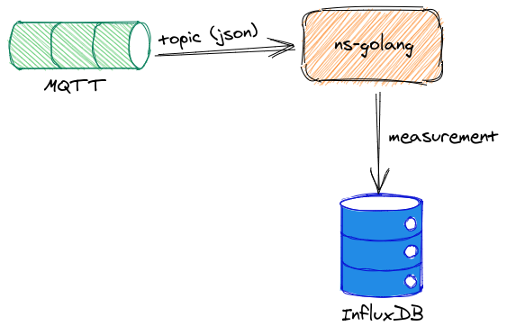

# MQTT client for iot
Nanoservice that suscribes just a Mqtt topic and save the data to InfluxDB. 

# Architecture


# Run
## Docker
```bash
# create dedicated network
$ docker network create --driver bridge iot
# run MongoDB container
$ docker run -itd -p 1883:1883 -p 9001:9001 --name mosquitto --network iot eclipse-mosquitto:1.6 
# run InfluxDB container
$ docker run -p 8086:8086 --name influx --network iot influxdb:1.8.4
# create a database into Influx 
$ docker exec -it influx influx 
$ create database iot
$ exit
# run microservice container
$ docker run -dit \
    --env MQTT_HOST=mosquitto  \
    --env MQTT_PORT=1883  \
    --env MQTT_TOPIC_NAME=/test/one  \
    --env INFLUXDB_HOST=http://influx:8086  \
    --env INFLUXDB_DATABASE_NAME=iot  \
    --env INFLUXDB_MEASUREMENT=test  \
    --name ns-mqtt-suscriber -p 8080:8080 --network iot b0rr3g0/mqtt-golang-influxdb:latest
```
## Kubernetes
This microservice could be deployed using Helm. I recommend the following Helm Chart: [https://github.com/dbgjerez/ms-helm-chart](https://github.com/dbgjerez/ms-helm-chart).

The configuration values.yaml that I have used: [values.yaml](https://github.com/dbgjerez/iot-k8s-stack/blob/master/mqtt-plants-suscriber/values.yaml)

The healthcheck endpoint check MongoDB and Mqtt server connection. If anyone of both fails, it returns 500 http code.
```bash
[GIN] 2021/02/13 - 20:59:51 | 200 |     594.029µs |       10.42.0.1 | GET      "/api/v1/health"
```

# Configuration
| Variable | Default value | Description |
| ------ | ------ | ------ |
| PORT | 8080 | Server port |
| GIN_MODE | debug | Gin gonic mode. (release for production mode) |
| MQTT_HOST | mqtt.server.com | Mqtt host |
| MQTT_PORT | 1883 | Mqtt port |
| MQTT_CLIENT_NAME | "" | Name of the ms when connect to Mqtt broker |
| MQTT_TOPIC_NAME | "" | Topic to suscription |
| INFLUXDB_HOST | "" | Influxdb host |
| INFLUXDB_DATABASE_NAME | "" | Influxdb database name |
| INFLUXDB_MEASUREMENT | "" | Influxdb measurement name for this nanoservice |

# Libraries
* Gin Gonic: Golang Framework
* InfluxDB client: Connection with InfluxDB https://github.com/influxdata/influxdb-client-go
* Mqtt client: Mqtt connection and listener https://github.com/eclipse/paho.mqtt.golang
* GoDotEnv: Library for env variables
